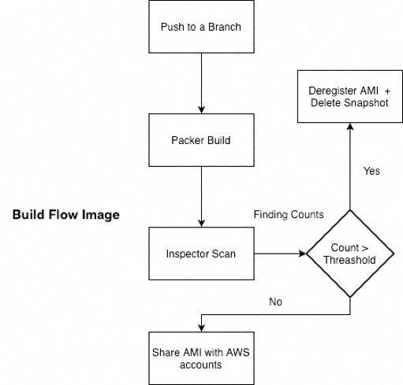

# CIS hardened Image
[[build-and-deploy](https://github.com/Puneet8800/CIS-Hardened-AMI/blob/main/.github/workflows/build_and_deploy.yml)]


**CIS (Level 1 + Level 2) Hardened Images for Cloud.**

This repo houses the config to build hardened and compliant cloud operating system images.

Often, customer security questionnaires ask about custom hardened images on the k8s nodes. This is the next step in building trust with the customer while securing workloads running on the cloud.
We have built this inhouse using opensource scripts since the commercial offerings are not a viable option and will prove too expensive based on our deployment startegy.

**Best part is that we have achieved better level of hardening than any commercial offering based on our tests.**


## Index
- [Repository Structure](#repository-structure)
- [Build Process](#build-process)
- [Diagrams](#build-flow-image)
- [Sharing AMI](#sharing-ami-across-orgs-and-regions)
- [Misc Info](#misc)
- [Prerequites](#Prerequites)
- [Development Setup](#development-setup)


---

## Repository Structure

All the packer config files are stored in the root. `builder.pkr.hcl` is the main config file. We use separate variable file which can be configured at runtime if needed.

### AMAZON Linux 2 CIS Submodule

We have used [ansible-lockdown/amazon2-cis](https://github.com/ansible-lockdown/amazon2-cis) as the source for our hardening.
This submodule was integrated to keep the script management easy and separate from the build process. Additional benefit would be the ability to make high quality contributions back to the original FOSS project without any extra overhead.


## Packer Build Process

GitHub Action automation plan:

1. use [eks optimized](https://docs.aws.amazon.com/eks/latest/userguide/eks-optimized-ami.html) image as base
2. run the hardening scripts using packer
3. install inspector agent
    > from scripts/inspector.sh
4. Built AMI is saved on the aws acc.
5. Launch an EC2 and run the Inspector scans.
    > from the "scan" job in GitHub action
6. Report the results
    > as part of "scan" job of github action
7. Finalize the AMI.
    > the AMI will be shared to the cloud team for further testing and rollout


#### Build Flow Image

*complete flow*


---
## Sharing AMI Across Orgs and Regions

The next problem after building the AMI is making it available across the AWS accounts and regions within the AWS organizational unit.

**The optimal solution**

AWS AMI provides us UI provides us option to share an AMI across Accounts (using acc. id) and OUs (using ou arn).

Then we also have an option to copy the same image across regions in the same account directly from the UI.


# Misc

| Key  | Value |
| ------------- | ------------- |
| AWS Account  | Account_Name (India)  |
| EKS  | 1.21.14  |
| Base AMI | `ami-09a3ebc18faf67c69` |
| Source | [AWS Docs](https://docs.aws.amazon.com/eks/latest/userguide/eks-optimized-ami.html) |


## Prerequites
- AWS Credentials to be setup on github secret as they are being used in github action.
- If you don't wish to use AWS credentials you can use assume role as well and replace the name in github action.
- Specify the region and store it in github secrets, Replace the name of the secret in github action.
- If your infra is behind VPN then store security group ID in github secrets and replace it in github action with your value.
- AWS account ID for sharing the AMI across the accounts, Store this as well in github secrets and replace it in github action.


## Development Setup

- fork the repo locally
- install [packer](https://developer.hashicorp.com/packer/downloads)
- setup AWS credentials will valid permissions
- verify the variables.pkr.hcl
- build commands

```
# check formatting
packer fmt .

# validate the logic
packer validate aws-eks-ami.pkr.hcl

# run the build
packer build -timestamp-ui aws-eks-ami.pkr.hcl

```

### Issues:
- scp and macos openssl compatibility issues for local dev

> Add scp flag in ansible extra args in packer builder: https://github.com/hashicorp/packer/issues/11783#issuecomment-1137052770
